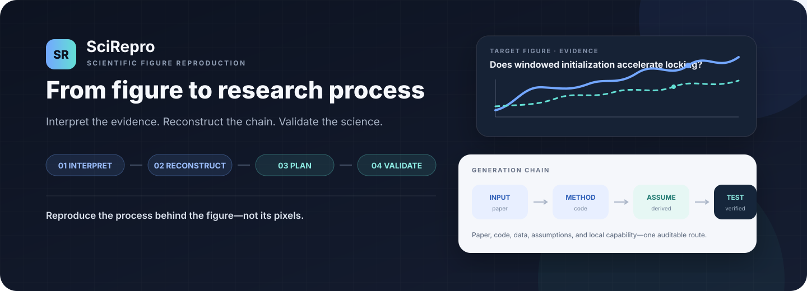

<p align="center">
  <picture>
    <source media="(max-width: 640px)" srcset="docs/assets/scirepro-hero-mobile.en.svg">
    
  </picture>
</p>

<p align="center">
  <a href="README.md">简体中文</a> · <strong>English</strong> · <a href="#start-in-30-seconds">Quick start</a> · <a href="scirepro/SKILL.md">Full specification</a>
</p>

SciRepro is a scientific-figure reproduction skill for Codex. It first materializes every target as a verifiable object, then interprets the figures, traces their generation chains, investigates reproduction conditions, and produces a local report containing the targets. It executes and validates only the route you approve.

> **Verify the targets. Investigate the routes. Validate the scientific result.**

## Start in 30 seconds

**Install**

```text
Use $skill-installer to install https://github.com/SciToolsmith/scirepro/tree/main/scirepro
```

**Invoke: every entry path accepts one or many figures**

```text
# Paper + figure references (the skill extracts complete targets)
Use $scirepro to analyze Figures 6, 7, and 11 from this paper.

# Paper + uploaded target image set
Use $scirepro to analyze this paper and these uploaded target images.

# Images only
Use $scirepro to reconstruct the visible curves, data, and layout in these images.
```

Every path first creates a `targets/` workspace with preserved sources, normalized PNGs, crop QA, and a hash manifest. Targets reliably matched to the paper and verified by QA use `scientific-reproduction`; images-only work uses the explicitly bounded `image-derived-reconstruction` mode.

## One evidence standard, adaptive workflow depth

SciRepro chooses the smallest workflow that can answer the request. An actual reproduction task always starts with a **local web report that displays the targets**, while a figure explanation is not forced into a maximum-strength audit.

| Depth | Use when | Report emphasis |
|---|---|---|
| **Explain / assess** | Meaning, generation logic, gaps, or likely feasibility only; no execution | Concise answer; materialize targets only when identity must be stabilized |
| **Compact report** | One clear local route with known inputs/tools and no restricted action | Executability, frozen assumptions, acceptance criteria |
| **Full audit** | Code/data/environment research, competing routes, uncertainty, or restricted actions | Evidence, routes, permission, budget, licenses, and risk |

Shorter workflows do not weaken target identity, claim boundaries, provenance, or validation criteria. Login, payment, large downloads, GPU, overwrite, upload, and publication always require explicit approval.

## One task, one result directory

An approved run delivers exactly one `scirepro-run-<run-id>/`. Single- and multi-target runs use the same shape; optional empty directories are not created.

```text
scirepro-run-<run-id>/
├── README.md              # Human entry: outcome, rerun steps, and limits
├── manifest.json          # File hashes, statuses, provenance, and integrity
├── report/                # Local result report required for complete/partial runs
├── shared/                # Shared plan, environment, sources, code, config, logs
└── targets/
    └── <target-id>/
        ├── result.json
        ├── outputs/       # Reproduced figures and derived artifacts
        ├── validation/    # Metrics, comparisons, and acceptance summary
        └── derived/       # Digitized or image-derived data, when used
```

The bundle records three separate conclusions: **whether execution completed**, **whether validation passed**, and **whether the paper claim is supported**. “The code ran” therefore cannot silently become “the claim was reproduced.” A complete or partial run combines the pre-execution decision page with actual outcomes in the final local report. Failed, blocked, or cancelled work is not forced to carry an empty result page, but is still finalized as an inspectable diagnostic bundle.

<details>
<summary><strong>Modes and rights boundaries</strong></summary>

### Two modes, two claim boundaries

- **With a paper: scientific reproduction.** Reconstruct the data–method–protocol–plot chain and validate predefined trends, peaks, frequencies, modes, statistics, or mechanism relationships.
- **Images only: image-derived reconstruction.** Trace, digitize, fit visible geometry, or rebuild layout, but claim only visible geometry and appearance—not recovery of the original data, method, experiment, or paper conclusion.

The local report must display every target directly. A public/shareable report embeds image bytes only when redistribution rights are verified; otherwise it shows a rights notice without exposing local paths or content.

</details>

<p align="center">
  <a href="scirepro/SKILL.md#evidence-and-route-model">Reproduction levels</a> ·
  <a href="scirepro/SKILL.md#permissions-and-approval">Approval boundary</a> ·
  <a href="scirepro/references/run-bundle-contract.md">Run-bundle contract</a>
</p>

<details>
<summary><strong>Manual installation and migration</strong></summary>

```bash
git clone https://github.com/SciToolsmith/scirepro.git
mkdir -p ~/.codex/skills
cp -R ./scirepro/scirepro ~/.codex/skills/scirepro
```

When migrating from ReproFig, confirm that `$scirepro` works before removing or disabling `~/.codex/skills/reprofig`.

</details>

## Open source and license

SciRepro is released under the [MIT License](LICENSE). Papers, datasets, third-party code, and generated artifacts retain their respective rights and licenses.
