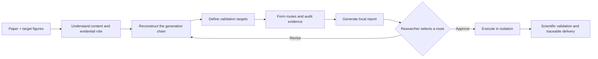

<div align="center">

# SciRepro

**From published figures to understandable, verifiable, and extensible research workflows.**

[简体中文](README.md) · **English**


[](LICENSE)

</div>

SciRepro is a scientific-figure reproduction skill for Codex. It treats a target figure as an **entry point into the paper's evidence**: first understand what the figure shows, then reconstruct the data, method, parameters, and plotting process that generated it, form evidence-backed reproduction routes, and—after researcher approval—execute and scientifically validate the selected route with traceable deliverables.

> **The goal is not to make an image that looks similar. The goal is to make the research process run again.**

## At a glance

| Input | Understand | Reconstruct | Deliver |
| --- | --- | --- | --- |
| Paper PDF / DOI<br>1–3 target figures | Observable phenomena<br>Evidential role<br>Reported claim | Data → method → protocol → validation<br>Candidate routes | Local investigation report<br>Code and reproduced figures<br>Logs, environment, and provenance |

It answers, in order: **what it supports → how it was generated → how far it can be reproduced → how success will be validated**.

[](docs/assets/report-preview.webp)

## Quick start

### 1. Install

```text
Use $skill-installer to install https://github.com/SciToolsmith/scirepro/tree/main/scirepro
```

### 2. Invoke

```text
Use $scirepro to study Figures 6, 7, and 11 from this paper.
First explain their scientific meaning and evidential role, reconstruct each generation chain,
assess the reproduction level, candidate routes, and validation criteria, and generate the local report.
Do not begin the full reproduction until I approve a specific route.
```

## Workflow



Phase 1 **understands, investigates, plans, and reports**. Phase 2 executes only the figures and routes explicitly approved by the researcher.

## What you receive

| Phase 1: investigation report | Phase 2: reproduction bundle |
| --- | --- |
| Figure interpretation and paper claim | Newly generated figures |
| Data–method–protocol–validation chain | Rerunnable code and configuration |
| Code, data, license, and provenance audit | Scientific validation and discrepancy analysis |
| Local capabilities, assumptions, gaps, and routes | Logs, environment lock, and provenance manifest |

<details>
<summary><strong>View the five reproduction levels</strong></summary>

| Level | When it applies |
| --- | --- |
| `direct-recompute` | The relevant implementation and paper-case input are available. |
| `mechanism-reproduction` | The method or simulation can be reconstructed from evidence and transparent assumptions. |
| `alternative-validation` | A declared substitute dataset or implementation tests a narrower transferable claim. |
| `editable-reconstruction` | A diagram is rebuilt as editable native objects; this is not numerical reproduction. |
| `original-case-blocked` | The original case depends on unavailable data, restricted resources, instruments, or irreducible method details. |

Every condition is also classified as **verified · derivable · assumable · missing · not required**. An unpublished parameter is not automatically a blocker when a defensible value can be derived or transparently assumed.

</details>

<details>
<summary><strong>Manual installation</strong></summary>

```bash
git clone https://github.com/SciToolsmith/scirepro.git
mkdir -p ~/.codex/skills
cp -R ./scirepro/scirepro ~/.codex/skills/scirepro
```

</details>

<details>
<summary><strong>Execution boundaries and researcher control</strong></summary>

SciRepro first checks existing local capabilities and evaluates downloads, installation, compute, and authorization only for scientifically justified routes. It never silently:

- replace the approved algorithm or data;
- describe substitute-data results as the original experiment;
- install proprietary software, accept licenses, log in, or pay;
- upload private material, contact third parties, or publish externally;
- exceed approved compute, network, storage, or overwrite limits;
- claim success from pixel similarity alone.

</details>

<details>
<summary><strong>Repository structure</strong></summary>

```text
.
├── README.md                 # Default Chinese documentation
├── README.en.md              # English
├── docs/assets/              # README preview assets
├── LICENSE
└── scirepro/
    ├── SKILL.md
    ├── agents/openai.yaml
    ├── assets/research-report-web/
    ├── references/
    └── scripts/
```

The helper scripts require Python 3.9 or newer and use only the Python standard library. MATLAB, Python packages, and other scientific runtimes required by a target paper are audited separately for each route.

</details>

<details>
<summary><strong>Upgrading from ReproFig</strong></summary>

Install `scirepro` and confirm that `$scirepro` is available before removing or disabling `~/.codex/skills/reprofig`. The former `$reprofig` invocation is not redirected.

</details>

See [scirepro/SKILL.md](scirepro/SKILL.md) for the complete workflow contract and implementation details.

## License

[MIT](LICENSE) © 2026 SciToolsmith. Papers, datasets, third-party code, and generated research artifacts retain their respective rights and licenses.
