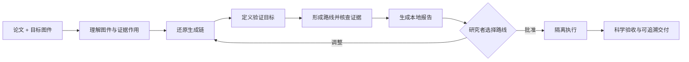

<div align="center">

# SciRepro

**从论文图件，回到可理解、可验证、可继续研究的过程。**

**简体中文** · [English](README.en.md)


[](LICENSE)

</div>

SciRepro 是一个面向 Codex 的科研图件复现 Skill。它把论文中的目标图视作**研究证据的入口**：先读懂图在说明什么，再还原生成它的数据、方法、参数与绘图流程，形成有证据支持的复现路线；经研究者批准后，执行并验证这条路线，交付可追溯的科研成果。

> **不是把图画得像，而是让生成这张图的研究过程重新跑起来。**

## 一眼看懂

| 输入 | 理解 | 重建 | 交付 |
| --- | --- | --- | --- |
| 论文 PDF / DOI<br>1–3 张目标图 | 图中现象<br>证据作用<br>论文主张 | 数据 → 方法 → 协议 → 验证<br>候选复现路线 | 本地研判报告<br>复现代码与图件<br>日志、环境与溯源记录 |

它依次回答：**支持什么主张 → 如何生成 → 能复现到什么程度 → 如何验收**。

[](docs/assets/report-preview.webp)

## 快速开始

### 1. 安装

```text
使用 $skill-installer 安装 https://github.com/SciToolsmith/scirepro/tree/main/scirepro
```

### 2. 调用

```text
使用 $scirepro 分析这篇论文中的图 6、图 7 和图 11。
先解释每张图的科学含义与证据作用，还原其生成链，
给出可复现程度、候选路线和验证标准，并生成本地报告。
在我批准具体路线前，不要开始完整复现。
```

## 工作流



第一阶段只负责**理解、调查、制定路线并生成报告**；第二阶段只执行研究者明确批准的图件和路线。

## 你会得到什么

| 第一阶段：研判报告 | 第二阶段：复现成果 |
| --- | --- |
| 图件解读与论文主张 | 生成的新图件 |
| 数据—方法—协议—验证链 | 可重新运行的代码与配置 |
| 代码、数据、许可与来源核验 | 科学验收结果与差异说明 |
| 本机能力、假设、缺口与候选路线 | 日志、环境锁定与溯源清单 |

<details>
<summary><strong>查看五级复现判定</strong></summary>

| 复现等级 | 适用情况 |
| --- | --- |
| `direct-recompute` | 作者实现与论文案例输入齐备，可直接复算。 |
| `mechanism-reproduction` | 可由论文、代码与透明假设重建方法或仿真，验证核心机制。 |
| `alternative-validation` | 用明确声明的替代数据或实现，验证范围更窄的可迁移结论。 |
| `editable-reconstruction` | 将流程图或示意图重构为原生可编辑对象，不属于数值复现。 |
| `original-case-blocked` | 原案例依赖不可获得的数据、受限资源、仪器或关键方法细节。 |

每项条件还会被标记为：**已核验 · 可推导 · 可合理假设 · 缺失 · 不需要**。未公开的参数不等于自动阻断；能够科学推导或透明设定的内容会被明确记录。

</details>

<details>
<summary><strong>手动安装</strong></summary>

```bash
git clone https://github.com/SciToolsmith/scirepro.git
mkdir -p ~/.codex/skills
cp -R ./scirepro/scirepro ~/.codex/skills/scirepro
```

</details>

<details>
<summary><strong>执行边界与研究者控制</strong></summary>

SciRepro 会优先检查本机已有环境，并只为已形成科学依据的路线评估下载、安装、计算和授权需求。以下操作不会被静默执行：

- 用未经批准的算法或数据替换原路线；
- 把替代数据结果称为原论文实验；
- 安装专有软件、接受许可证、登录或付费；
- 上传私有材料、联系第三方或公开发布；
- 超出批准的计算、网络、存储或覆盖范围；
- 仅凭像素相似度宣称复现成功。

</details>

<details>
<summary><strong>仓库结构</strong></summary>

```text
.
├── README.md                 # 默认中文说明
├── README.en.md              # English
├── docs/assets/              # README 预览资源
├── LICENSE
└── scirepro/
    ├── SKILL.md
    ├── agents/openai.yaml
    ├── assets/research-report-web/
    ├── references/
    └── scripts/
```

Skill 辅助脚本需要 Python 3.9 或更高版本，并且只使用 Python 标准库。目标论文所需的 MATLAB、Python 软件包或其他科研运行环境会按路线单独核查。

</details>

<details>
<summary><strong>从 ReproFig 升级</strong></summary>

先安装 `scirepro` 并确认 `$scirepro` 已出现，再删除或停用旧的 `~/.codex/skills/reprofig`。旧调用名 `$reprofig` 不会自动重定向。

</details>

完整工作契约与实现细节见 [scirepro/SKILL.md](scirepro/SKILL.md)。

## 许可证

[MIT](LICENSE) © 2026 SciToolsmith。论文、数据集、第三方代码和生成的科研成果仍遵循各自的版权与许可证。
