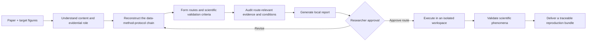

# ReproFig

**English** | [简体中文](README.zh-CN.md)

**From published figures to reproducible research workflows.**

ReproFig is a Codex skill that uses scientific figures as entry points into the research behind them. Given a paper and one to three target figures, it interprets what each figure shows and the role it plays in the paper's argument, reconstructs the data, method, parameters, and plotting protocol that produced it, evaluates the available evidence, and turns that analysis into an understandable, executable, verifiable, and traceable reproduction task.

ReproFig aims to reproduce the research process and its key scientific phenomenon—not the pixels of the published image. After the researcher approves an evidence-backed route, it can execute the reproduction, validate the result against scientific criteria, and deliver the code, configuration, logs, environment record, and provenance needed to inspect, rerun, or extend the work.

A reproduced figure is not the endpoint. It is a documented bridge from a published claim to a research process that can be understood, questioned, adapted, and built upon.

> Understand the evidence. Reconstruct the process. Test the reported claim.

## What ReproFig does

1. **Interpret the figure as scientific evidence.** Read the caption, axes, legends, panels, nearby text, equations, methods, and supplements to explain what the figure shows and what claim it supports.
2. **Reconstruct how the figure was produced.** Trace the input data, preprocessing, method implementation, parameters, randomization, statistical procedure, plotting protocol, and dependencies between figures.
3. **Form evidence-backed reproduction routes.** Combine evidence from the paper, code, data, public sources, and available local capabilities; distinguish what is verified, derivable, assumable, missing, or not required; assign one defensible reproduction level to each figure; and state the scientific scope and limits of every candidate route.
4. **Execute and validate the research process.** After approval, run the selected route in an isolated workspace and evaluate units, axes, peaks, trends, modes, statistics, uncertainty, and other scientifically meaningful acceptance criteria.
5. **Preserve a foundation for further research.** Record sources, assumptions, environments, patches, commands, and results so that researchers can compare implementations, replace data, test sensitivity, adapt methods, and design follow-up studies.

## From a static figure to a research process

A published figure compresses a long generative chain—inputs, preprocessing, equations or code, parameters, randomness, instruments, statistical choices, and plotting decisions—into a static image. ReproFig makes that hidden chain explicit so that the figure can be studied as the result of a research process rather than treated as an image to imitate.

Scientific figure reproduction is therefore not the same as tracing the published image or fitting a curve to its pixels. A defensible reproduction needs evidence about:

1. the exact, simulatable, or explicitly substituted input data;
2. the method implementation or a derivable implementation route;
3. parameters, preprocessing, randomization, and plotting protocol;
4. the observable phenomenon and acceptance criteria that will count as successful validation;
5. the route-specific runtime, packages, toolboxes, hardware, and licenses.

ReproFig organizes these conditions into an auditable evidence map. It does not silently guess when information is incomplete, and it does not declare a figure impossible merely because a per-figure author script, random seed, or cached output is missing.

## Workflow



### Phase 1 — Understand, investigate, and plan

- resolves the paper version and target figure IDs;
- explains what each figure shows, why it appears in the paper, and which phenomenon or conclusion must be validated;
- reconstructs the figure's data-method-protocol chain and upstream dependencies;
- proposes explicit reproduction routes, assumptions, scientific scope, and validation criteria;
- searches official sources before secondary implementations and inspects relevant code and data rather than merely collecting links;
- verifies provenance, dataset identity, versions, licenses, and access conditions;
- audits available local runtimes, packages, toolboxes, hardware, and compatible execution options;
- records route-specific resource estimates and blockers;
- generates a self-contained local HTML report and an approval draft, then stops before the full reproduction run.

### Phase 2 — Reproduce and validate the approved route

- validates the report hash, selected figures, route, assumptions, resource limits, and authorized effects;
- works in an isolated, versioned run directory and preserves the original code and data;
- documents derivations, assumptions, compatibility patches, commands, and discrepancies;
- reproduces one figure at a time and validates the scientific phenomenon rather than relying on visual resemblance alone;
- delivers generated figures together with the code, configuration, logs, environment details, validation results, and provenance needed to rerun the work.

## Reproduction levels

| Level | Meaning |
| --- | --- |
| `direct-recompute` | The relevant implementation and paper-case input are available. |
| `mechanism-reproduction` | The method or simulation can be reconstructed to test the reported mechanism. |
| `alternative-validation` | A declared substitute dataset or implementation tests a narrower claim. |
| `editable-reconstruction` | A diagram is rebuilt as editable native objects; this is not numerical reproduction. |
| `original-case-blocked` | An irreducible original input, protected resource, instrument, or method detail is unavailable. |

Each figure receives one level. ReproFig separately classifies every required condition as **verified**, **derivable**, **assumable**, **missing**, or **not required**, making clear both what has been reproduced and where the evidence stops.

## A foundation for follow-up research

ReproFig is designed to support more than one successful rerun. By making the figure's generating chain, assumptions, evidence limits, and validation criteria explicit, it gives researchers a traceable starting point for comparing implementations, replacing datasets, testing sensitivity, adapting methods, and designing follow-up studies. Reproduction does not automatically create new research; it makes the published work understandable enough to build on responsibly.

## Installation

Ask Codex to install the inner `reprofig/` skill directory with the built-in Skill Installer:

```text
Use $skill-installer to install https://github.com/SciToolsmith/reprofig/tree/main/reprofig.
```

For a manual personal installation, copy the `reprofig/` directory into your Codex skills directory:

```bash
git clone https://github.com/SciToolsmith/reprofig.git
mkdir -p ~/.codex/skills
cp -R ./reprofig/reprofig ~/.codex/skills/reprofig
```

The installed directory must contain `reprofig/SKILL.md`; do not install the outer repository directory as the skill. Codex normally discovers newly installed skills automatically. If it does not appear in `/skills`, restart Codex.

ReproFig's helper scripts require Python 3.9 or newer and use only the Python standard library. MATLAB, Python packages, and other scientific runtimes needed by a target paper are audited separately and are not bundled with this repository.

## Usage

Provide a paper PDF or DOI and one to three target figures:

```text
Use $reprofig to study Figures 6, 7, and 11 from this paper.
Explain what each figure demonstrates, reconstruct its data-method-protocol-validation chain,
assess the available reproduction routes, and generate the local report first.
Wait for my approval before executing a route.
```

The Phase 1 report contains the figure interpretation and argumentative role, reproduction level, evidence map, code and data sources, local capability check, access and license status, assumptions, blockers, scientific validation target, resource estimate, and proposed routes. An approved Phase 2 run adds the generated figures, reproducible code and configuration, validation results, logs, environment details, and provenance.

## Execution safeguards and researcher control

Environment checks, bounded downloads, isolated environments, resource estimates, and approval gates protect the execution of a scientifically justified route; they are not substitutes for understanding the figure or reconstructing the research process.

During investigation, ReproFig first checks existing local software and may inspect bounded public artifacts or create an isolated open-source environment within the investigation budget. Large or controlled-access downloads, proprietary software, license acceptance, login, payment, uploads, material route changes, and effects beyond the approved compute, storage, network, or overwrite limits remain explicit researcher decisions.

ReproFig does not silently:

- replace the requested algorithm with an unofficial port;
- substitute another dataset and call it the original experiment;
- install proprietary software or accept license terms;
- log in, pay, upload private material, or contact third parties;
- exceed approved compute, download, storage, or overwrite limits;
- claim success from pixel similarity alone.

## Repository structure

```text
.
├── README.md
├── README.zh-CN.md
├── LICENSE
└── reprofig/
    ├── SKILL.md
    ├── agents/openai.yaml
    ├── assets/feasibility-web/
    ├── references/
    │   ├── investigation-schema.md
    │   ├── source-environment-audit.md
    │   ├── permission-gates.md
    │   ├── web-report-contract.md
    │   └── execution-validation.md
    └── scripts/
        ├── probe_environment.py
        ├── inspect_artifact.py
        ├── build_report.py
        └── plan_gate.py
```

The Markdown references define the evidence, permission, reporting, and execution contracts. The scripts provide deterministic environment probing, safe artifact inspection, report generation, and approval-plan validation.

## License

[MIT](LICENSE) © 2026 SciToolsmith. The license covers this repository's original instructions, scripts, and report template. Papers, datasets, third-party code, and generated research artifacts retain their respective rights and licenses.
