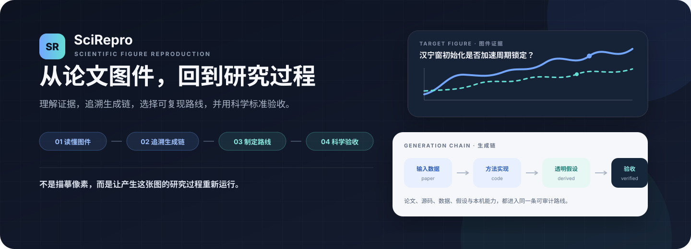

<p align="center">
  <picture>
    <source media="(max-width: 640px)" srcset="docs/assets/scirepro-hero-mobile.zh-CN.svg">
    
  </picture>
</p>

<p align="center">
  <strong>简体中文</strong> · <a href="README.en.md">English</a> · <a href="#30-秒开始">快速开始</a> · <a href="scirepro/SKILL.md">完整规范</a>
</p>

SciRepro 是面向 Codex 的科研图件复现 Skill。它先把每一张目标图物化为可核验对象，再解释图件、追溯生成链、调查复现条件、生成带原图的本地报告；你批准具体路线后，它才执行与验收。

> **目标图先核验，复现路线再研判，科学结论最后验收。**

## 30 秒开始

**安装**

```text
使用 $skill-installer 安装 https://github.com/SciToolsmith/scirepro/tree/main/scirepro
```

**调用：三种入口都支持一张或多张图**

```text
# 论文 + 图号（Skill 自动提取完整图件）
使用 $scirepro 分析这篇论文的图 6、图 7 和图 11。

# 论文 + 上传的目标图片集
使用 $scirepro 分析这篇论文与我上传的这些目标图。

# 仅图片集
使用 $scirepro 重构这些图片中可见的曲线、数据和版式。
```

三种入口都会先建立 `targets/` 工作区，保存原始文件、规范化 PNG、裁切 QA 与哈希清单。与论文可靠匹配并通过 QA 的目标进入 `scientific-reproduction`；仅图片模式进入边界明确的 `image-derived-reconstruction`。

## 你会得到什么

- **目标图集** — 每张目标图均保留来源、页码或用户标签、裁切信息、QA 状态与哈希。
- **本地研判报告** — 直接展示全部目标图、图件解读、生成链、候选路线、缺口与本机条件。
- **复现路线** — 数据、方法、协议、假设、缺口、本机条件与科学验收标准清晰可查。
- **可追溯成果** — 可重新运行的代码、生成图件、配置、验证结果、日志与来源记录。

## 先报告，再执行

**批准前：**核验目标图、调查证据、制定路线并生成本地报告。报告直接展示每张复现对象，并区分已核验、可推导、可合理假设和真正缺失的条件。

**批准后：**只执行你选定的图件与路线；如果数据、算法、环境、预算或支持的主张发生实质变化，SciRepro 会停下并重新确认。

## 两种模式，不混淆结论

- **有论文：科学复现。**重建数据—方法—协议—绘图链，以预先定义的趋势、峰值、频率、模态、统计量或机制关系验收。
- **只有图片：图像派生重构。**可以描线、数字化、拟合外形或重建版式，但只说明可见几何与外观；不声称恢复了原始数据、方法、实验或论文结论。

本地报告必须直接显示全部目标图。公开分享版只有在确认再分发权后才嵌入图片；否则只显示版权边界，不泄露本地路径或图像字节。

<p align="center">
  <a href="scirepro/SKILL.md#evidence-model">复现判定</a> ·
  <a href="scirepro/SKILL.md#approval-gate">批准边界</a> ·
  <a href="scirepro/SKILL.md#deliverables">完整交付</a>
</p>

<details>
<summary><strong>手动安装与旧版迁移</strong></summary>

```bash
git clone https://github.com/SciToolsmith/scirepro.git
mkdir -p ~/.codex/skills
cp -R ./scirepro/scirepro ~/.codex/skills/scirepro
```

从 ReproFig 升级时，先确认 `$scirepro` 可用，再删除或停用旧目录 `~/.codex/skills/reprofig`。

</details>

## 开源与许可

SciRepro 采用 [MIT License](LICENSE)。论文、数据集、第三方代码和生成成果仍遵循各自的版权与许可证。
