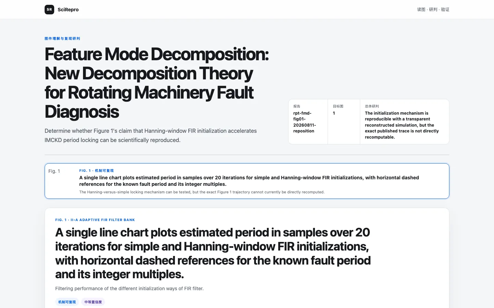

<h1 align="center">SciRepro</h1>

<p align="center"><strong>从论文图件，回到可验收的研究过程</strong></p>
<p align="center">把目标图变成可核验的对象、可批准的复现路线和可检验的科学结果。</p>
<p align="center"><strong>简体中文</strong> · <a href="README.en.md">English</a> · <a href="#快速开始">快速开始</a> · <a href="scirepro/SKILL.md">完整规范</a></p>

## 快速开始

**安装**

```text
使用 $skill-installer 安装 https://github.com/SciToolsmith/scirepro/tree/main/scirepro
```

**调用**

```text
使用 $scirepro 复现这篇论文的图 6 和图 7。
```

论文加图号、论文加上传图片、仅图片都可以；单图和多图使用同一条工作流。

算法流程图、机制图、技术路线图和科研架构图会在入口处直接移交给 `sci-diagram-pptx`，不再进入 SciRepro 的核验、报告与审批流程。若伴生 Skill 缺失，SciRepro 会从固定的官方公开提交自动安装到用户级 Skills 目录后继续；不会自动安装其运行时或系统软件。

## 先看报告，再决定

**核验目标图 → 追溯生成链 → 形成复现路线 → 本地研判报告 → 你批准 → 执行与科学验收**

真正执行前，SciRepro 会先生成带目标图的本地网页版报告并停下。报告说明图件在表达什么、如何生成、本机能复现到什么程度、还缺什么，以及每条路线能支持和不能支持的结论。

[](docs/assets/report-preview.webp)

<p align="center"><sub>真实报告示例 · 点击查看原尺寸</sub></p>

只有你批准具体目标、路线、假设、资源与权限边界后，SciRepro 才开始执行。

## 你会得到

- **批准前：**已核验的目标图集，以及可审阅的本地研判报告。
- **批准后：**一个可复跑的结果文件夹，包含代码、配置、图件、验证、日志、来源和哈希。
- **每个目标：**分别记录执行是否完成、验收是否通过、论文主张是否得到支持。

## 科学边界

> **代码成功运行，不等于图件通过验收；图件通过验收，也不自动等于论文主张得到支持。**

- **有论文：**重建数据—方法—协议—绘图链，按预先声明的科学现象或指标验收。
- **只有图片：**只重构可见曲线、几何和版式，不声称恢复原始数据、实验、方法或论文结论。
- 公式、参数和作者代码是优先证据，不是默认正确的真值；只核验与目标图直接相关的部分。
- 保留未迎合原图调参的基线和有效负面结果，不以像素相似度替代科学验收。
- 登录、付费、大型下载、GPU、覆盖、上传和公开发布需要明确批准。

## 文档与许可

[复现判定](scirepro/SKILL.md#evidence-and-route-model) ·
[批准边界](scirepro/SKILL.md#permissions-and-approval) ·
[结果包规范](scirepro/references/run-bundle-contract.md)

SciRepro 采用 [MIT License](LICENSE)。论文、数据集、第三方代码和生成成果仍遵循各自的版权与许可证。
