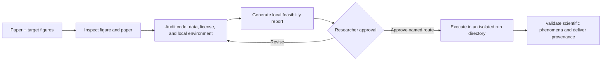

# ReproFig

**Evidence-first scientific figure reproduction for Codex.**

ReproFig helps researchers determine whether a figure from a scientific paper can be reproduced on the current computer—before committing to large downloads, new environments, proprietary software, or long-running jobs.

> 先研判，再复现。

It reads the figure together with its paper context, audits local runtimes, searches and inspects code and data, checks licenses and provenance, and produces a local feasibility report. Full reproduction starts only after the researcher approves a concrete route.

## Why ReproFig

Reproducing a scientific figure is not the same as tracing the published image or fitting a curve to its pixels. A defensible reproduction needs evidence about:

1. the local runtime, packages, toolboxes, hardware, and licenses;
2. the exact, simulatable, or substitute input data;
3. the method implementation or a derivable implementation route;
4. parameters, preprocessing, randomization, and plotting protocol;
5. the observable phenomenon that will count as successful validation.

ReproFig turns those conditions into an auditable decision instead of silently guessing or declaring a figure impossible because one author script is missing.

## Two-phase workflow



### Phase 1 — Investigate

- identifies what the figure shows and why it appears in the paper;
- checks local MATLAB, Python, R, Julia, proprietary tools, packages, and hardware;
- searches official sources before secondary implementations;
- downloads only bounded public artifacts during investigation;
- records versions, sizes, SHA-256 hashes, access conditions, and licenses;
- reads interfaces and key source code instead of merely pasting links;
- verifies that discovered data actually correspond to the paper case;
- generates a self-contained local HTML report and an approval draft;
- stops before the full reproduction run.

### Phase 2 — Reproduce the approved route

- validates the report hash and approval scope;
- works in an isolated, versioned directory;
- preserves original code and data;
- documents assumptions and compatibility patches;
- checks units, axes, peaks, trends, modes, statistics, and variability;
- delivers code, configuration, figures, logs, environment details, and provenance.

## Reproduction levels

| Level | Meaning |
| --- | --- |
| `direct-recompute` | The relevant implementation and paper-case input are available. |
| `mechanism-reproduction` | The method or simulation can be reconstructed to test the reported mechanism. |
| `alternative-validation` | A declared substitute dataset or implementation tests a narrower claim. |
| `editable-reconstruction` | A diagram is rebuilt as editable native objects; this is not numerical reproduction. |
| `original-case-blocked` | An irreducible original input, protected resource, instrument, or method detail is unavailable. |

Missing per-figure scripts, random seeds, or cached author outputs are not automatically blockers. ReproFig distinguishes conditions that are **verified**, **derivable**, **assumable**, **missing**, or **not required**.

## Installation

Ask Codex to install the inner `reprofig/` skill directory with the built-in Skill Installer:

```text
Use $skill-installer to install https://github.com/SciToolsmith/reprofig/tree/main/reprofig.
```

For a manual personal installation, copy the `reprofig/` directory into your Codex skills directory:

```bash
git clone https://github.com/SciToolsmith/reprofig.git
mkdir -p ~/.codex/skills
cp -R ./reprofig/reprofig ~/.codex/skills/reprofig
```

The installed directory must contain `reprofig/SKILL.md`; do not install the outer repository directory as the skill. Codex normally discovers newly installed skills automatically. If it does not appear in `/skills`, restart Codex.

ReproFig's helper scripts require Python 3.9 or newer and use only the Python standard library. MATLAB, Python packages, and other scientific runtimes needed by a target paper are audited separately and are not bundled with this repository.

## Usage

Provide a paper PDF or DOI and one to three target figures:

```text
Use $reprofig to assess whether Figures 6, 7, and 11 can be reproduced on this computer.
Generate the feasibility report first and wait for my approval before execution.
```

ReproFig will return a local report containing the figure interpretation, reproduction level, local capability check, code/data sources, access and license status, assumptions, blockers, validation target, resource estimate, and proposed route.

## Repository structure

```text
.
├── README.md
├── LICENSE
└── reprofig/
    ├── SKILL.md
    ├── agents/openai.yaml
    ├── assets/feasibility-web/
    ├── references/
    │   ├── investigation-schema.md
    │   ├── source-environment-audit.md
    │   ├── permission-gates.md
    │   ├── web-report-contract.md
    │   └── execution-validation.md
    └── scripts/
        ├── probe_environment.py
        ├── inspect_artifact.py
        ├── build_report.py
        └── plan_gate.py
```

The Markdown references define the evidence and permission contracts. The scripts provide deterministic environment probing, safe artifact inspection, report generation, and approval-plan validation.

## Safety and research integrity

ReproFig does not silently:

- replace the requested algorithm with an unofficial port;
- substitute another dataset and call it the original experiment;
- install proprietary software or accept license terms;
- log in, pay, upload private material, or contact third parties;
- exceed approved compute, download, storage, or overwrite limits;
- claim success from pixel similarity alone.

Access-controlled resources, large downloads, paid services, semantic algorithm changes, and external side effects remain explicit researcher decisions.

## License

[MIT](LICENSE) © 2026 SciToolsmith. The license covers this repository's original instructions, scripts, and report template. Papers, datasets, third-party code, and generated research artifacts retain their respective rights and licenses.
