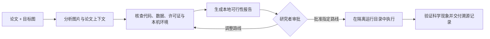

# ReproFig

[English](README.md) | **简体中文**

**面向 Codex 的证据优先科研图件复现 Skill。**

ReproFig 帮助研究者在投入大规模下载、搭建新环境、使用专有软件或启动长时间计算之前，先判断科学论文中的图能否在当前计算机上被复现。

> 先研判，再复现。

它会结合论文上下文理解目标图，核查本机运行环境，检索并审阅代码与数据，检查许可证和溯源信息，并生成本地可行性报告。只有在研究者批准明确的复现路线后，才会进入完整复现阶段。

## 为什么需要 ReproFig

科研图件复现并不等于描摹已发表图片，也不等于根据像素拟合曲线。可信的复现需要确认以下证据：

1. 本机运行时、软件包、工具箱、硬件和许可证；
2. 原始输入数据、可按论文构造的仿真数据，或明确声明的替代数据；
3. 作者方法的实现，或能够从论文与源码推导出的实现路线；
4. 参数、预处理、随机化过程和绘图流程；
5. 可用于判断复现成功的可观察现象与验收标准。

ReproFig 将这些条件整理成可审计的决策依据，而不是在信息不足时静默猜测，也不会仅因作者未提供某张图的专用脚本就直接判定无法复现。

## 两阶段工作流



### 第一阶段：研判

- 识别目标图展示了什么，以及它在论文论证中的作用；
- 检查本机 MATLAB、Python、R、Julia、专有软件、软件包和硬件；
- 优先检索作者或出版方等官方来源，再考虑第三方实现；
- 调查阶段只下载体积和风险均受控的公开资源；
- 记录版本、文件大小、SHA-256、访问条件和许可证；
- 阅读接口与关键源码，而不是只粘贴一个链接；
- 验证找到的数据是否确实对应论文案例；
- 生成自包含的本地 HTML 可行性报告和审批草案；
- 在完整复现运行前停止，等待研究者批准。

### 第二阶段：执行已批准的复现路线

- 校验报告哈希和审批范围；
- 在隔离、可追踪的版本化目录中工作；
- 保留作者原始代码和数据，不直接改写唯一副本；
- 记录所有假设和兼容性补丁；
- 核验单位、坐标轴、峰值、趋势、模态、统计量和随机波动；
- 交付代码、配置、图件、日志、环境信息和完整溯源记录。

## 复现等级

| 等级 | 含义 |
| --- | --- |
| `direct-recompute` | 相关实现与论文案例输入均已获得，可直接复算。 |
| `mechanism-reproduction` | 可重建论文方法或仿真过程，以验证论文报告的机制。 |
| `alternative-validation` | 使用明确声明的替代数据或实现，验证范围更窄的结论。 |
| `editable-reconstruction` | 将流程图或示意图重构为原生可编辑对象；这不属于数值复现。 |
| `original-case-blocked` | 原案例必需的输入、受限资源、仪器或方法细节无法获得。 |

缺少某张图的专用脚本、随机种子或作者缓存的中间结果，并不会自动构成阻断。ReproFig 会进一步区分条件是**已核验**、**可推导**、**可合理假设**、**缺失**还是**不需要**。

## 安装

可以让 Codex 使用内置 Skill Installer 安装仓库中的 `reprofig/` Skill 目录：

```text
使用 $skill-installer 安装 https://github.com/SciToolsmith/reprofig/tree/main/reprofig。
```

也可以手动安装到个人 Codex Skills 目录：

```bash
git clone https://github.com/SciToolsmith/reprofig.git
mkdir -p ~/.codex/skills
cp -R ./reprofig/reprofig ~/.codex/skills/reprofig
```

安装后的目录中必须包含 `reprofig/SKILL.md`；不要把仓库最外层目录直接当作 Skill 安装。Codex 通常会自动发现新安装的 Skill。如果它没有出现在 `/skills` 中，请重启 Codex。

ReproFig 的辅助脚本需要 Python 3.9 或更高版本，并且只依赖 Python 标准库。目标论文所需的 MATLAB、Python 软件包或其他科研运行环境会被单独核查，不随本仓库分发。

## 使用方法

提供论文 PDF 或 DOI，并指定一至三张目标图：

```text
使用 $reprofig 评估这台计算机能否复现论文中的图 6、图 7 和图 11。
先生成可行性报告，等我批准后再执行复现。
```

ReproFig 会返回一份本地报告，其中包含图件解读、复现等级、本机能力核验、代码与数据来源、访问和许可证状态、假设条件、阻断项、验收目标、资源估算以及建议的复现路线。

## 仓库结构

```text
.
├── README.md
├── README.zh-CN.md
├── LICENSE
└── reprofig/
    ├── SKILL.md
    ├── agents/openai.yaml
    ├── assets/feasibility-web/
    ├── references/
    │   ├── investigation-schema.md
    │   ├── source-environment-audit.md
    │   ├── permission-gates.md
    │   ├── web-report-contract.md
    │   └── execution-validation.md
    └── scripts/
        ├── probe_environment.py
        ├── inspect_artifact.py
        ├── build_report.py
        └── plan_gate.py
```

Markdown 参考文件定义了证据与权限契约。辅助脚本提供确定性的环境探测、安全的资源检查、报告生成和审批计划校验。

## 安全与科研诚信

ReproFig 不会静默执行以下行为：

- 将用户指定的算法替换为未经批准的第三方移植版本；
- 使用其他数据集，却把结果称为原论文实验；
- 安装专有软件或代替用户接受许可证条款；
- 登录账号、付费、上传私有材料或联系第三方；
- 超出已批准的计算、下载、存储或文件覆盖范围；
- 仅凭像素相似度宣称复现成功。

需要访问控制的资源、大规模下载、付费服务、算法语义修改以及会影响外部系统的操作，始终由研究者明确决定。

## 许可证

[MIT](LICENSE) © 2026 SciToolsmith。该许可证适用于本仓库原创的说明、脚本和报告模板。论文、数据集、第三方代码以及生成的科研成果仍遵循各自的版权与许可证。
